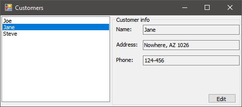
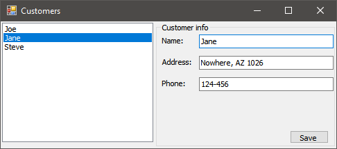
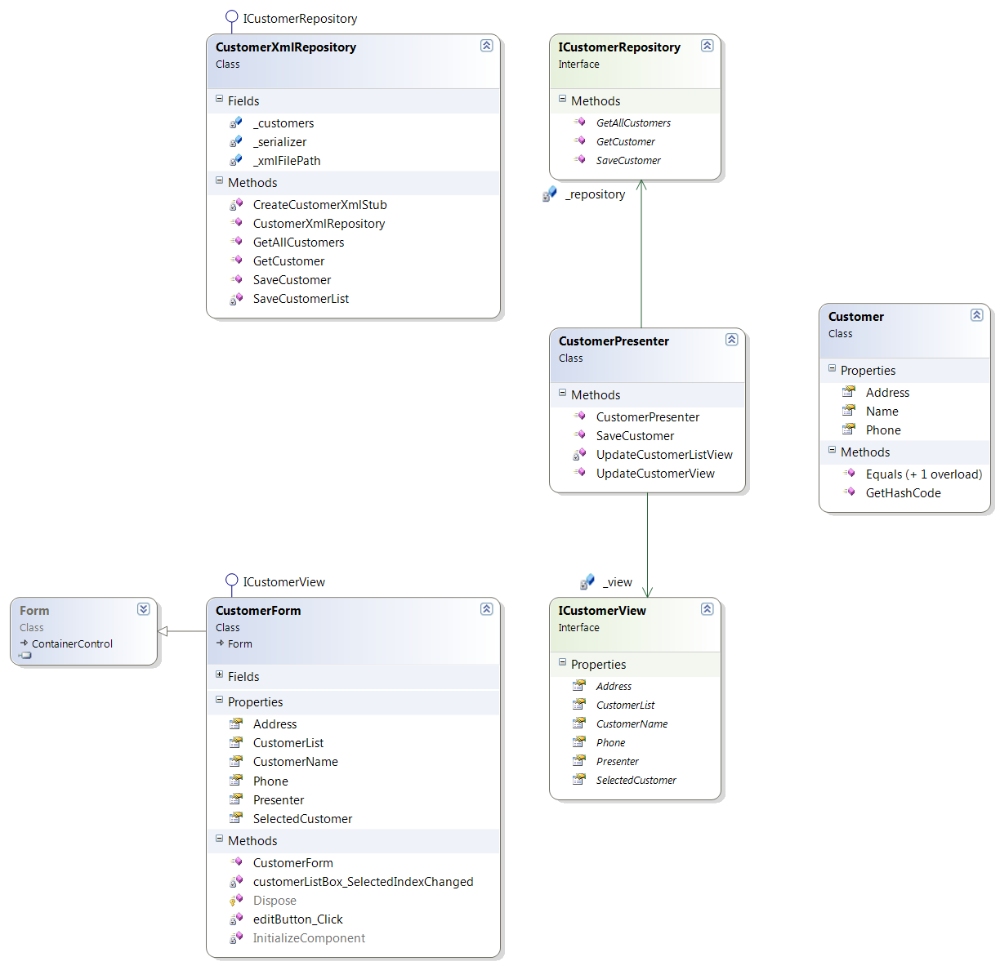

# Model-View-Presenter (Passive View) in Windows Forms

There are remarkably few straightforward, minimal examples of the _Passive view_ (or _Humble dialog_) variety of the Model-View-Presenter pattern for Windows Forms.

This project aims to fill the gap.

The common MVVM way of using _INotifyPropertyChanged_ to connect the model to the view and have no presenter or the presenter as a bystander takes us to the _Supervising Controller_ land. Here, by design, everything is managed by the Presenter instead.

## Screenshots

## MVP Class Diagram

